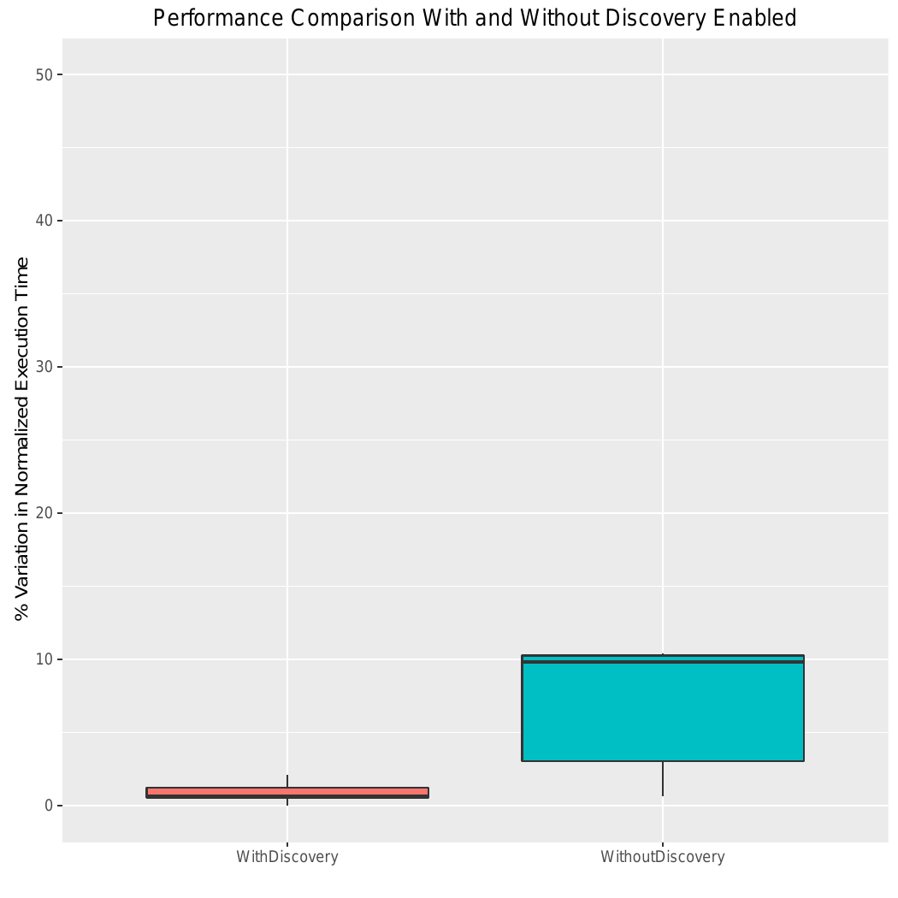
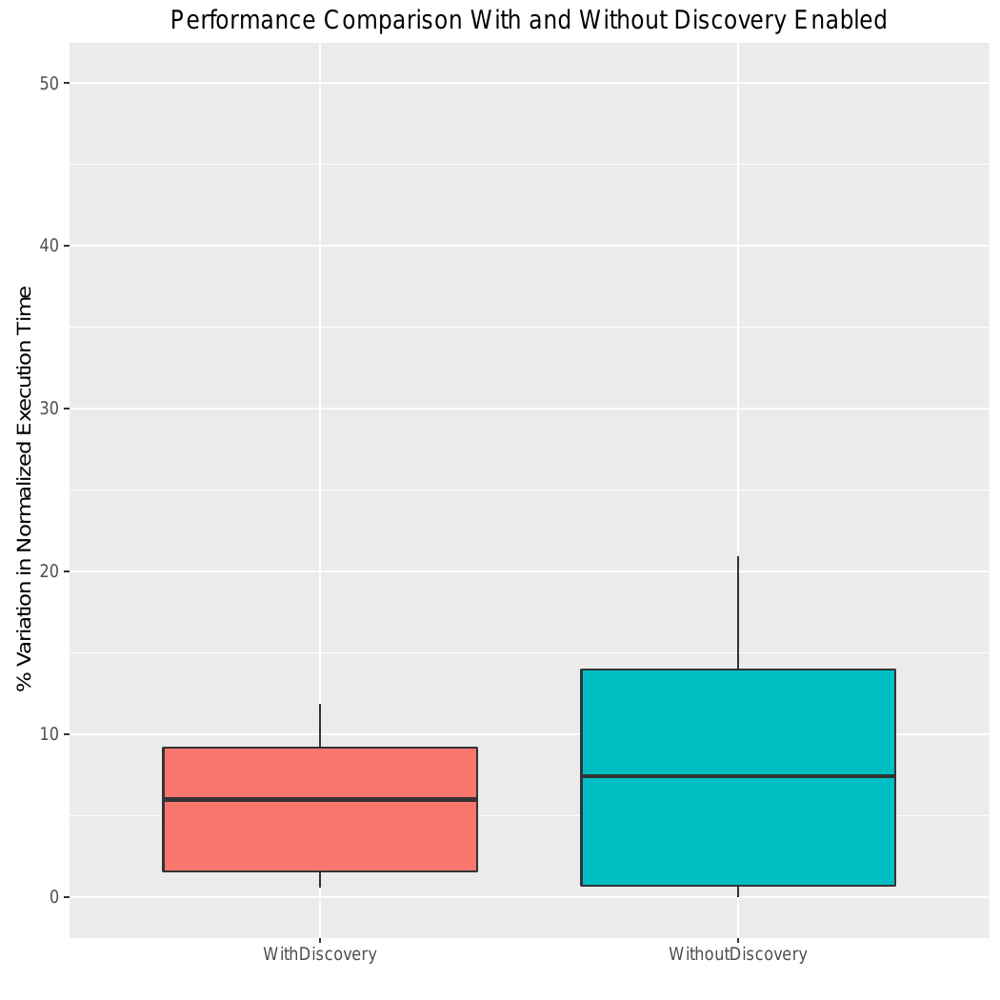

# Demo on Node Feature Discovery
- [Demo Overview](#demo-overview)
- [Instructions to Reproduce the Demo](#instructions-to-reproduce-the-demo)
- [Source for the Demo Images](#source-for-the-demo-images)

## Demo Overview 
In order to show the potential performance benefit from the node feature discovery project, we ran an experiment on three identical Kubernetes nodes. Each node consists of a single-socket Intel(R) Xeon(R) D-1521 with eight cores. 

We wanted to demonstrate how to target nodes with turbo boost using node feature discovery. Turbo boost is a hardware feature which allows dynamic overclocking of CPUs. Using this feature, can result in a potential performance benefit. But naively using turbo boost can be detrimental to performance for some applications [[1]][ref-1]. The ability to target nodes with or without turbo boost depending on the application can be useful in such scenarios. We intentionally disabled turbo boost in two of these nodes for demo purposes.

Our experiment involved running the same application ten times with and without node feature discovery. We use the Ferret benchmark from the PARSEC benchmark suite [[2]][parsec] as our application. The benchmark implements an image similarity search. It is expected to benefit from turbo boost as it is CPU intensive [[3][ref-3], [4][ref-4]]. 

Without node feature discovery, two-thirds of the application instances will run on nodes without turbo boost and as a result be less-performant. By using feature discovery, we are able to target the node with turbo boost and gain performance. A pod template to express affinity to nodes with turbo boost can be found [here](helper-scripts/demo-pod-with-discovery.yaml.parsec.template).

The figure below shows box plots that illustrates the variability in normalized execution time of running ten application instances with and without node feature discovery. The execution time of the runs are normalized to the best-performing run and the change in the normalized execution time is shown (0 represents the best performing run). With node feature discovery, under this experimental setup, we can see significant improvement in performance. Moreover, we also reduce the performance variability between different application instances.



In contrast, some applications do not benefit from using turbo boost. We use CloverLeaf mini-app from the Mantevo benchmark suite [[5]][ref-5] to show how certain applications will benefit from using nodes without turbo boost [[6]][ref-6]. The mini-app solves compressible Euler equations on a Cartesian grid. Our experiment was the same as before (i.e., run ten instances of CloverLeaf with and without node feature discovery). 

Without node feature discovery, one-third of the instances are expected to be less-performant. We use node anti-affinity to target nodes without turbo boost and improve the performance. A pod template to express anti-affinity to nodes with turbo boost can be found [here](helper-scripts/demo-pod-with-discovery.yaml.cloverleaf.template). 

The figure below shows the variation of normalized performance (execution time) of running the application instances with and without node feature discovery. Similar to our previous example, with anti-affinity to nodes without turbo boost we gain performance and decrease performance variability. 



While our example illustrates the benefits of using node feature discovery with and without turbo boost, it can be used to gain performance predictability and improvement for other applications by targeting nodes with other features and configurations in a Kubernetes cluster. For example, many scientific and machine learning applications can benefit from targeting nodes with AVX instruction set [[7][ref-7], [8][ref-8]] and many web services can take advantage of the AES-NI instruction set [[9][ref-9]]. Moreover, complex user requirements can be expressed by targeting nodes with multiple features and a combination of configurations.

## Instructions to Reproduce the Demo

Scripts to reproduce our demo results can be found in [helper-scripts](helper-scripts/).  
### Prerequisites
1. `kubectl` should be configured properly to work with your Kubernetes cluster.
2. Node feature discovery should have been already deployed on your Kubernetes cluster. 
 
### Instructions 
Follow these easy steps to reproduce the demo. 

1. `cd <helper-script-root>`
2. `./run-with-discovery.sh -a parsec`
3. `./run-with-discovery.sh -a cloverleaf`
4. `./run-without-discovery.sh -a parsec`
5. `./run-without-discovery.sh -a cloverleaf`
6. `./aggregate-logs-and-plot.sh -a parsec`
7. `./aggregate-logs-and-plot.sh -a cloverleaf`

Following the above steps will produce the performance and normalized performance logs and their corresponding plots for each application. 

### Script Documentation
`run-with-discovery.sh` takes the application name as the input and runs ten application instances using node feature discovery. 
```sh
> ./run-with-discovery.sh -h
    Usage: run-with-discovery.sh [-a APPLICATION_NAME]
    Runs pods ten times with discovery enabled.

    -a APPLICATION_NAME     run the pods with APPLICATION_NAME application.
                            APPLICATION_NAME can be one of parsec or cloverleaf.
```

`run-without-discovery.sh` takes the application name as the input and runs ten application instances without using node feature discovery. 
```sh
>./run-without-discovery.sh -h
    Usage: run-without-discovery.sh [-a APPLICATION_NAME]
    Runs ten pods without discovery enabled with the specified application.

    -a APPLICATION_NAME     run the pods with APPLICATION_NAME application.
                            APPLICATION_NAME can be one of parsec or cloverleaf.
```

`aggregate-logs-and-plot.sh` takes the application name as the input and aggregates the logs from the runs with and without node feature discovery and plots the result. 
```sh
>./aggregate-logs-and-plot.sh -h
    Usage: aggregate-logs-and-plot.sh [-a APPLICATION_NAME]
    Aggregate the results from the specified application and plot the result.

    -a APPLICATION_NAME     run the pods with APPLICATION_NAME application.
                            APPLICATION_NAME can be one of parsec or cloverleaf
```

### Source for the Demo Images
The Dockerfiles for the demo images can be found in [docker-images](docker-images/). The Dockerfile for the PARSEC demo is [Dockerfile-PARSEC](docker-images/Dockerfile-PARSEC) and the CloverLeaf demo is [Dockerfile-CloverLeaf](docker-images/Dockerfile-CloverLeaf). The demo images are hosted in `quay.io` under the `kubernetes_incubator` organization. 

<!-- Links -->
[parsec]: http://parsec.cs.princeton.edu/
[ref-1]: http://csl.stanford.edu/~christos/publications/2014.autoturbo.hpca.pdf
[ref-3]: http://parsec.cs.princeton.edu/publications/bienia08characterization.pdf
[ref-4]: http://parsec.cs.princeton.edu/publications/bienia08comparison.pdf
[ref-5]: https://mantevo.org
[ref-6]: https://mantevo.org/about/publications
[ref-7]: https://software.intel.com/en-us/intel-mkl
[ref-8]: https://software.intel.com/en-us/blogs/daal
[ref-9]: https://software.intel.com/en-us/articles/intel-aes-ni-performance-enhancements-hytrust-datacontrol-case-study

