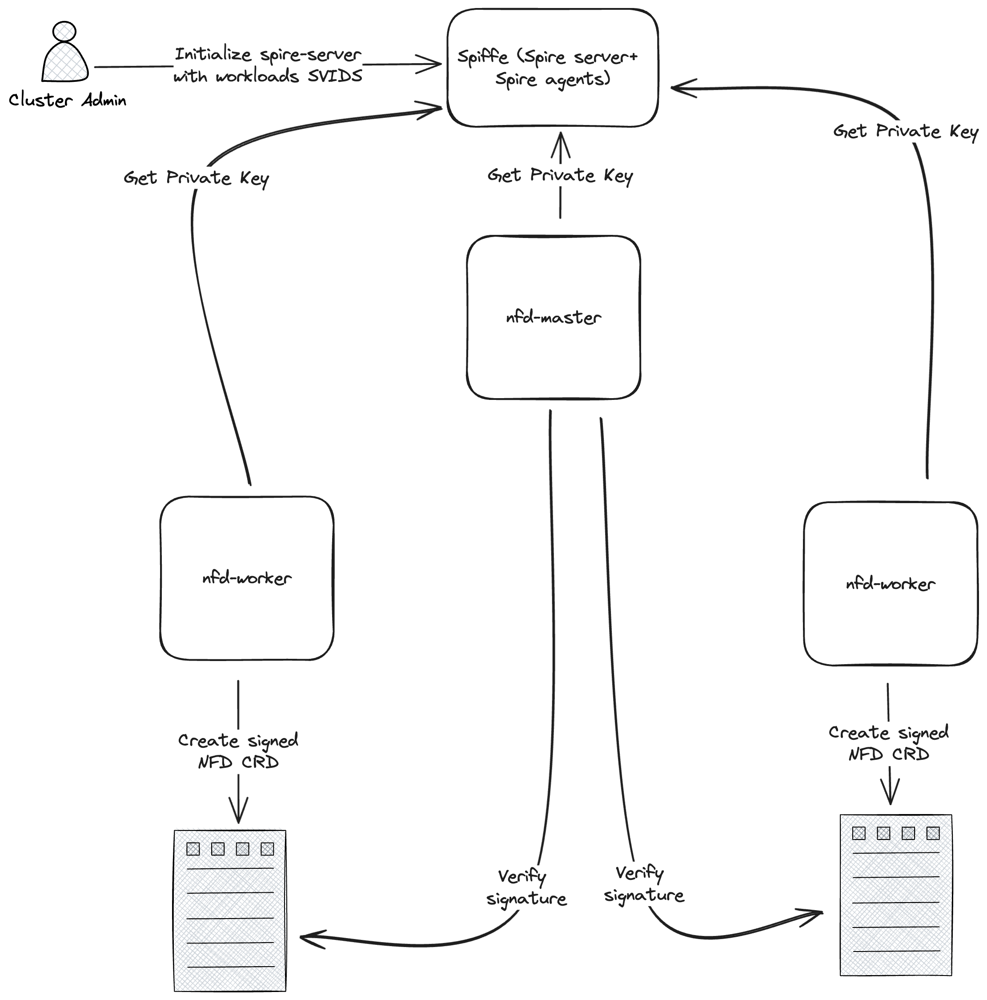

# KEP-1186: Spiffe integration in NFD

<!-- toc -->
- [Summary](#summary)
    - [Goals](#goals)
    - [Non-Goals](#non-goals)
- [Proposal](#proposal)
    - [Notes](#notes)
    - [Risks and Mitigations](#risks-and-mitigations)
- [Design Details](#design-details)
    - [Test Plan](#test-plan)
<!-- /toc -->

## Summary
- **Goals:** The goal of this enhancement is to improve the security of NFD by signing the NFD specs using a private key attributed to nfd-worker, eliminating the potential of exposing wrong features which can be done via a malicious workload in the middle.
- **Non-Goals:** This proposal does not aim to present how Spiffe works, but rather focuses on the integration of Spiffe in the NFD project.

## Proposal

As shown in the figure above, the proposed solution involves:

1. Installation of Spiffe which is composed of Spire-agents as daemonset, and Spire-server as statefulset. Spiffe installation should be available in Helm as well as Kustomize.

2. The cluster administration (who intends to use NFD), should initialize the Spire-server with the specific Spiffe Verifiable Identity Document ID a.k.a SVID. In fact, we need to have only one SVID shared between all of the nfd-worker workloads. Initialization commands should be provided in docs.

3. The private key that is used for the data signature and the public key that is responsible for the signature verification are the ones associated with the SVID. That being said, the nfd-master and nfd-worker should be able to fetch the SVID from spiffe to perform signing and verification processes.

4. After features discovery, nfd-workers need to get their private key from Spiffe and sign the NodeFeature CR spec with their private keys. The signature should be put in the annotations section of the NodeFeature CR. e.g.: `annotations.signature`

5. When detecting new changes in the NodeFeature CR, the nfd-master should verify the signature in the CR by using the public key of the nfd-workers.

Such a process would result in exposing only features created by the nfd-worker. In fact, when a workload/user changes manually the NodeFeature CR, updates won't be propagated to nodes.

### Notes
- The signature of NodeFeature CR spec is encoded in base64 to make it utf-8 encoded, since the signature itself is not utf-8 encoded, and might have special characters that can result in some errors.
- The nfd-master does not need any sort of SVID as it does not need to sign data.
- If users need to integrate 3rd party tools along with NFD, they need to create their respective SVIDs in the Spire-server, so that exposed data can be validated.
- This feature should be noted as EXPERIMENTAL, and enabling/disabling Spiffe verification should be configurable for users via cmdline or configuration file.
- Some tweaks that need to be done to the cluster in order to enable Spiffe that should be mentioned in docs. Example of Minikube configuration tweak: https://spiffe.io/docs/latest/try/getting-started-k8s/#considerations-when-using-minikube

### Risks and Mitigations
- Workloads communication with Spire-agent and Spire-server is done through a Unix socket, which should be mounted from the host to workloads, which is not really recommended from a security perspective.
- Despite the security measures applied while using Spiffe, the nfd-master is not able to verify whether the created `NodeFeature` object targeting `node A` is actually created by an nfd-worker instance deployed on `node A`. i.e. a malicious nfd-worker instance deployed on `node B` can create a `NodeFeature` object targeting `node A`.
As a mitigation, further security measures should be applied by Cluster administrators.

## Design Details
- Create a Spiffe utility structure in `pkg/utils` that would be responsible for exposing the following functions:
    - `NewSpiffeClient`: returns a new `workloadapi.Client` which allows us to communicate with the spire-server.
    - `SignData`: returns a signature of a given spec.
    - `VerifyDataSignature`: checks the validity of the given data signature.
    
    This utility would use the Golang built-in `crypto/rsa` and `crypto/edcsa` packages for the signature and verification of the signature depending on the SVID algorithm.
- The signature is created out of the `.spec`, `.metadata.name`, `.metadata.namespace`, `.metadata.labels`, and `.metadata.annotations` objects.
- In the nfd-worker, before creating/updating a NodeFeature CR we should update its CR and add the signature in the annotations section.
- In the nfd-master, whenever a new NodeFeature CR is created/updated we should verify the signature, before updating nodes.

### Test Plan
To ensure the proper functioning of the integration of Spiffe, the following test plan should be executed:
1. **Unit Tests:** Write unit tests for the Spiffe related-functions, like `SignData` and `VerifyDataSignature`.
2. **Manual e2e Tests:** Deploy nfd-worker and nfd-master along with Spiffe. We should ensure that Spiffe verification is enabled. At first, we should check that the created NodeFeature CR has a signature and node features are successfully exposed. Then, we should update manually the CR spec, and check that changes are not propagated.
