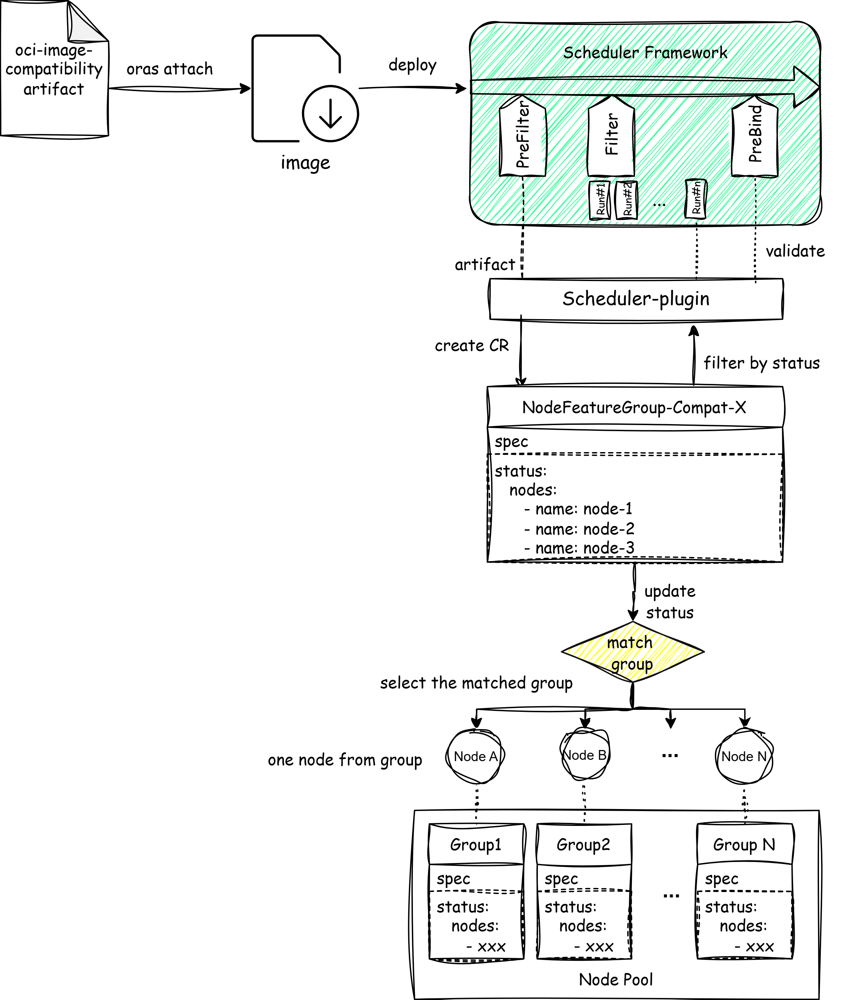

#  KEP-2403: Image Compatibility Scheduler with NFD
<!-- toc -->
- [Summary](#summary)
- [Motivation](#motivation)
- [Proposal](#proposal)
  - [User Stories](#user-stories)
  - [Risks and Mitigations](#risks-and-mitigations)
    - [Group Homogeneity Enforcement](#group-homogeneity-enforcement)
    - [Node Features Drift Handling](#node-features-drift-handling)
    - [NFG Status Update Latency](#nfg-status-update-latency)
- [Design Details](#design-details)
  - [Proposal C: Node Pre-grouping](#proposal-c-node-pre-grouping)
  - [Test Plan](#test-plan)
  - [Graduation Criteria](#graduation-criteria)
    - [Alpha](#alpha)
    - [Beta](#beta)
    - [GA](#ga)
- [Implementation History](#implementation-history)
- [Alternatives Considered](#alternatives-considered)
  - [Use Node Affinity/Node Selector Directly in Pod Spec](#use-node-affinitynode-selector-directly-in-pod-spec)
  - [Alternative design proposals](#alternative-design-proposals)
    - [Proposal A: NodeFeatureGroup Check](#proposal-a-nodefeaturegroup-check)
    - [Proposal B: SQLite Database Caching for Node Features in Large Scale Clusters](#proposal-b-sqlite-database-caching-for-node-features-in-large-scale-clusters)
<!-- /toc -->

## Summary

Cloud-native technologies are being adopted by high-demand industries where container compatibility is critical for service performance and cluster preparation.
Building upon the first phase of [KEP-1845 Proposal](https://github.com/kubernetes-sigs/node-feature-discovery/blob/master/enhancements/1845-nfd-image-compatibility/README.md), which completed node compatibility validation, this proposal introduces a compatibility scheduling plugin. This plugin utilizes `NodeFeatureGroup` to filter nodes that meet compatibility requirements. It effectively schedules pods to compatible nodes, enabling automated and intelligent compatibility scheduling decisions to meet the application's need for a specific, compatible environment.

## Motivation

The first phase of [KEP-1845 Proposal](https://github.com/kubernetes-sigs/node-feature-discovery/blob/master/enhancements/1845-nfd-image-compatibility/README.md) introduced compatibility metadata to help container image authors describe compatibility requirements in a standardized way. This metadata is uploaded to the image registry alongside the image. Based on this container compatibility metadata, the compatibility scheduler plugin automatically analyzes the compatibility requirements of container images, filters suitable nodes for scheduling, and ensures that containers run on compatible nodes.

## Proposal

### User Stories

When deploying applications that require specific hardware or software features (e.g., AVX2 support, specific kernel versions, or GPU availability), users want to ensure that their pods are scheduled only on nodes that meet these compatibility requirements. This is particularly important for workloads in high-performance computing, machine learning, and other specialized domains where compatibility directly impacts performance and functionality.

The core of this proposal is to implement an `ImageCompatibilityPlugin` within the Kubernetes scheduler framework. During the **Prefilter phase** of the scheduling cycle, this plugin dynamically creates a `NodeFeatureGroup` Custom Resource based on the image compatibility metadata obtained from the OCI Artifact to describe node requirements. It then uses the list of matching nodes in the resource's `status` field to filter compatible candidate nodes during the **Filter phase** of the scheduling cycle.

To achieve high-performance scheduling from basic validation to large scale cluster scenarios, we have designed three solutions based on the above foundational architecture. The proposal C is our preferred solution. Node pre-grouping can significantly reduce the number of compatibility checks required during scheduling. 

### Risks and Mitigations
#### Group Homogeneity Enforcement
Group homogeneity is critical for proposal C to ensure that representative node checks accurately reflect the compatibility of the entire group. How to make sure that all nodes within a pre-group are actually homogeneous?

Cluster administrators are responsible for ensuring homogeneity when they define the pre-groups. It's mandatory for cluster administrators and up to the group strategy. It's similar to how node pools are managed in many large scale clusters.

#### Node Features Drift Handling
When node features drift over time (e.g., due to software updates or hardware changes), it can lead to mismatches between the pre-group definitions and the actual node capabilities. This drift can compromise the effectiveness of the pre-grouping strategy.
It can be divided into two scenarios:
1. **Drift Before Scheduling:** If a node drifts before the scheduling process, the pre-groups will be updated accordingly during the next `NodeFeatureGroup` update (trigger immediately). Thus, the scheduling process will always work with the most current node features.
2. **Drift After Scheduling:** When drift happens after the scheduling process, the scheduled pods will not effect until next schedule time. --We'll need to add a monitoring mechanism to watch for drifted nodes, alert, and have administrators trigger rescheduling.

#### NFG Status Update Latency
If `NodeFeatureGroup` status updates are delayed, it can lead to stale information being used during the scheduling process. This latency can impact the accuracy of compatibility checks and potentially result in suboptimal scheduling decisions. However, since the pre-grouping can reduce the latency of NFG updates, the impact of this latency is limited. Still, adding a last-second validation of node features before the final binding step could be considered to further mitigate this risk.

## Design Details
### Proposal C: Node Pre-grouping



For large scale clusters, node pre-grouping is a method to significantly reduce computational overhead. The core idea is to pre-organize all nodes into several groups based on specific, static rules (e.g., `cpu.model`, `kernel.version`). This optimization changes the scheduling complexity from checking **N (number of nodes)** down to just **G** groups (**G<<N**) in the critical path.

The process involves these main phases:

1. **Initial Cluster Grouping:** In the cluster preparation stage, administrator should divide the cluster nodes into several groups by `NodeFeatureGroup`. Multiple `NodeFeatureGroup` Custom Resources (CRs) are created declaratively, each defining a grouping rule. Their status is populated with all matching nodes, completing the pre-grouping setup.
2. **Scheduling Prefilter Phase:** When a pod requires specific image compatibility, the scheduler plugin:
   - Fetches the OCI Artifact and extracts its compatibility metadata.
   - Creates a new `NodeFeatureGroup` CR that represents these dynamic compatibility demands.
   - **Evaluates compatibility through a representative sampling strategy:** For each group, it **selects one representative node** (for example, the node with the lexicographically smallest name in the group's `status.nodes` list) and checks if this node satisfies the compatibility rules specified in the `NodeFeatureGroup` CR.
     - If the representative node **matches** the compatibility demands, then **all nodes** within that pre-group are considered compatible, and the entire group is selected .
     - If the representative node **does not match**, the entire group is skipped, and the evaluation proceeds to the next pre-group.
   - Updates the status of the compatibility `NodeFeatureGroup` CR with the node group selected. 
3. **Scheduling Filter Phase:** The scheduler filters candidate nodes by checking their presence in the status of the relevant ephemeral `NodeFeatureGroup` CR, ensuring they meet the computed compatibility requirements.
4. **Scheduling PreBind Phase (Optional):** An optional final validation step can be added to re-verify node compatibility before binding, ensuring that any update latency is accounted for.

**Example Flow:** Assume 10000 nodes are pre-grouped into 10 groups (`Group-1` to `Group-10`). For a pod with a new compatibility demand, the scheduler creates `NodeFeatureGroup-Compat-X`. It sequentially evaluates the pre-groups. If `Group-1`'s representative node can match compatibility demand, all nodes from `Group-1` are immediately added to `NodeFeatureGroup-Compat-X`. If it doesn't match, the entire `Group-1` is skipped. The process repeats with `Group-2`, and continues sequentially until a matching group is found. This approach reduces the number of compatibility evaluations in the critical path from **10,000 individual node checks** to **at most 10 representative node checks**. If no group's representative node satisfies the demand, the system correctly concludes that no compatible nodes exist in the cluster, as the pre-grouping is designed to ensure feature homogeneity within each group.

**Key Characteristics:**

- **Administrator-Driven Grouping:** Node groups are statically predefined by the cluster administrator in cluster preparation phase. And pre-grouping needs to make sure the node homogeneity within each group.
- **Representative Node Matching:** The core performance optimization is achieved by evaluating only a **single representative node** from each pre-existing group against the dynamic compatibility rules, rather than scanning all nodes.
- **Schedule Based on NFG:** During the filter stage, candidate nodes are validated through a simple lookup of the precomputed `NodeFeatureGroup` status.
- **NFG lifecycle management:** The compatibility `NodeFeatureGroup` CR created during prefilter is ephemeral. When ephemeral CRs created, use OwnerReferences to track their lifecycle. It can be garbage-collected after pod completion to avoid resource bloat. While the pre-defined grouping `NodeFeatureGroup` CRs persist in the cluster.
- **Last-Second Validation (Optional):** The optional pre-bind phase allows for a final check of node compatibility before binding, accommodating any update latency.

**Exception Handling:**
- If the OCI Artifact is unreachable or lacks compatibility metadata, the plugin defaults to allowing scheduling on any node, ensuring that the absence of metadata does not block pod deployment. However, the log will record a warning for visibility.
- If no pre-group's representative node matches the compatibility demands, the plugin correctly concludes that no compatible nodes exist in the cluster, resulting in a scheduling failure for the pod with logging an error.
- If a pre-group is found to be empty (i.e., its `status.nodes` list is empty), the plugin skips that group during evaluation, ensuring that only valid groups are considered.

**Advantages**

- **Significant Reduction in Computational Cost:** Shifts the complexity in the scheduling critical path from `O(N)` to `O(G)` (G is the group number, G<<N), delivering orders-of-magnitude performance improvement.
- **Aligns with Common Large Scale Cluster Practice:** Node grouping is common in large scale cluster, where administrators define multiple `NodeFeatureGroup` resources and assign nodes to these groups in advance.

**Limitations**

- **Small Modification to NodeFeatureGroup Operations**: Including a small amount of the `NodeFeatureGroup` operation modification.
- **Dependency on Group Homogeneity:** Requires administrator management for homogeneous grouping.

### Test Plan

To ensure the proper functioning of the compatibility scheduler plugin, the following test plan should be executed:

- **Unit Tests:** Write unit tests for the plugin.
- **Manual e2e Tests:** Deploy a sample pod with compatibility artifact. Test the `NodeFeatureGroup` updates correctly and the pod is scheduled to compatibility node successfully.
- **Performance Tests:** Measure the latency of scheduling decisions and `NodeFeatureGroup` status updates.

To ensure the performance in a large scale cluster, we may need to simulate dev environment which contains at least 1000 nodes. We can spin up a k8s in k8s cluster, where pods act as nodes for the nested cluster. The kubemark is also useful.

### Graduation Criteria

#### Alpha
- Implement the basic compatibility scheduler plugin (Proposal A).
- Initial e2e tests completed and enabled.
#### Beta
- Implement performance optimizations (Proposal C).
- Performance tests completed in large scale cluster simulation.
- Gather feedback from developers and users.
#### GA
- Feedback is collected on usability of the field.
- Example of real-world usage.

## Implementation History
- 2025-12-27: KEP proposal submission
- 2026-01-20: Update KEP with proposal C(Node pre-grouping) chosen as preferred solution.
## Alternatives Considered

### Use Node Affinity/Node Selector Directly in Pod Spec
Using standard Kubernetes features like Node Affinity or Node Selector directly in the Pod specification to specify compatibility requirements was considered. However, this approach has several limitations:
- Not all node features are reflected in labels.
- Compatibility rules are typically structured, multi-dimensional, and frequently updated. Node affinity/Node selector, in essence, is a static label-matching system and is unsuitable to handle such dynamic and complex requirements.
- In large scale clusters, node affinity/node selector does not perform well in terms of time consumption.

### Alternative design proposals
#### Proposal A: NodeFeatureGroup Check


The basic solution is a direct, on-demand approach by utilizing the `NodeFeatureGroup` Custom Resource (CR) to dynamically define and manage node compatibility groups at scheduling time.

**Workflow:**

1. **CR Creation and Update (Prefilter Phase):** When a pod with specific image requirements enters the scheduling queue, the scheduler plugin fetches the attached OCI Artifact. It extracts the compatibility metadata (e.g., required kernel features) and **instantly creates a new `NodeFeatureGroup` CR**. This CR's specification defines the dynamic compatibility rules.

   The `update NodeFeatureGroup` operation evaluates **all nodes in the cluster** against the CR's specification rules and updates the CR's `status` field with the list of nodes that satisfy the compatibility demands.

   ```yaml
   apiVersion: nfd.k8s-sigs.io/v1alpha1
   kind: NodeFeatureGroup
   metadata:
     name: node-feature-group-example
   spec:
     featureGroupRules:
       - name: "kernel version"
         matchFeatures:
           - feature: kernel.version
             matchExpressions:
               major: {op: In, value: ["6"]}
   status:
     nodes:
       - name: node-1
       - name: node-2
       - name: node-3
   ```

2. **Node Filtering (Filter Phase):** In the scheduler's final filter phase, retrieve the dynamically created `NodeFeatureGroup` CR and filters the candidate nodes, ensuring that only nodes listed in the CR's `status` are considered compatible.

**Advantages**

- **Simplicity:** Filter candidate nodes by compatible nodes set from `NodeFeatureGroup`.
- **Non-Invasive:** Without modifications to existing `NodeFeatureGroup` operation.

**Limitations**

- **Performance Limitation:** The requirement to evaluate **all cluster nodes** for each scheduling request creates a linear scalability bottleneck (`O(N)` complexity). In a large scale cluster (e.g., 65,000 nodes), this introduces significant latency in the scheduling critical path.
- **No Caching:** Repeated scheduling for similar image requirements results in redundant node evaluation work, as no intermediate results are cached or reused.

#### Proposal B: SQLite Database Caching for Node Features in Large Scale Clusters


NodeFeatureGroup(NFG) updates status by computing all nodes' features. It can become performance bottleneck in a large scale cluster. The problem is conceptually similar to **map-reduce**, where data must be aggregated before processing.

To achieve this, we’ll need an additional controller that watches nodes, collects reports from workers, and maintains a cache database with grouped nodes. NFG would then act on this cached, grouped data instead of raw per node inputs. Fast lookups will depend on an efficient cache data structure.

**Cache Implement** 

- **Implementation**: The NFD master is extended to include an **embedded SQLite database**, which functions as a high-performance local sink. It continuously aggregates and stores feature reports (e.g., CPU flags, kernel versions, PCI devices) collected from NFD worker daemons across all nodes in the cluster.
- **Data Model:** The database adopts an indexed **Entity-Attribute-Value (EAV) schema**. Each record explicitly links a node (the Entity) with a specific feature name (the Attribute) and its current state (the Value), enabling complex, multi-dimensional queries for node grouping.
- **Persistence:** To ensure data durability, the enhanced NFD master pod is configured with a **PVC (~100 GB)**. For optimal I/O performance critical to low-latency queries, the use of high-performance storage solutions (**Longhorn** or **local storage**) is recommended.

**NFG Update**

- **Fast Query**: When a NFG is deployed, the master can run a fast local sql query to determine which nodes match the group’s conditions (e.g. `cpu.avx2=true`, `kernel.version>=6.6`, `pci.vendor=10de`). 
- **Pre Load**: Any image artifacts related NFG could be fetched asynchronously before scheduling (e.g., by an admission webhook or a small controller). The sqlite database is used only as a **precomputation engine** and not contained within the scheduling process. The NFG update process can be completed before scheduler process. The scheduler plugin would then watch those results in memory and perform constant time membership checks during scheduling. This approach keeps the scheduler’s filter phase pure and nonblocking, avoiding disk or network I/O inside the hot path. 

**Scheduler Process**

- **Fetch results from NFG**: The scheduling workflow remains conceptually consistent with the basic solution (Solution 1). The critical difference is that all computationally expensive operations have been shifted to the asynchronous precomputation stage. The scheduler plugin just retrieves the precomputed results from the NFG status to identify the compatible nodes group.

**Advantages**

- **High Performance with Fast Queries:** By leveraging an indexed SQLite database with an EAV schema, node feature queries are executed with high efficiency. 
- **Non-blocking Scheduler Filter Phase:**  All node evaluation and `NodeFeatureGroup` status calculations are completed asynchronously.

**Limitations**

- **Modification to NodeFeatureGroup Operations**
- **More work with NFG fetch webhook/controller:** This might become a new feature or a standalone solution.