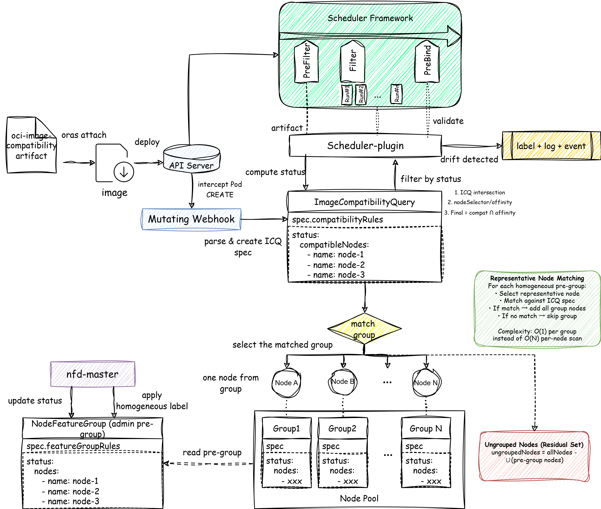
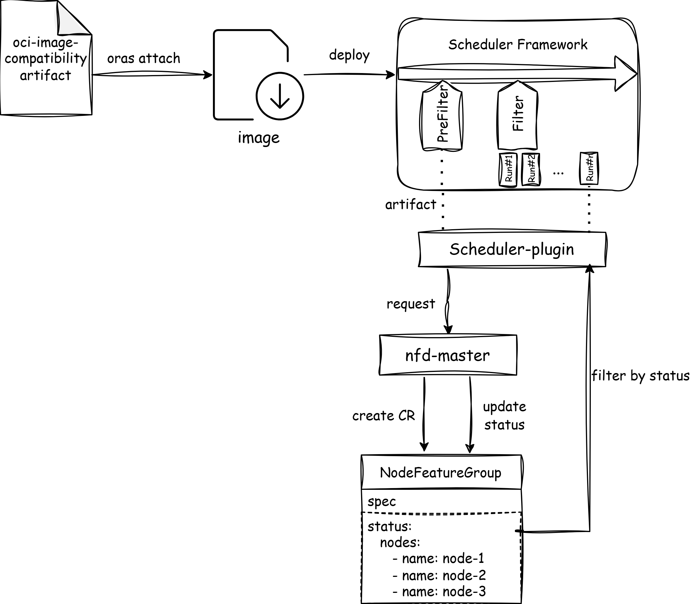
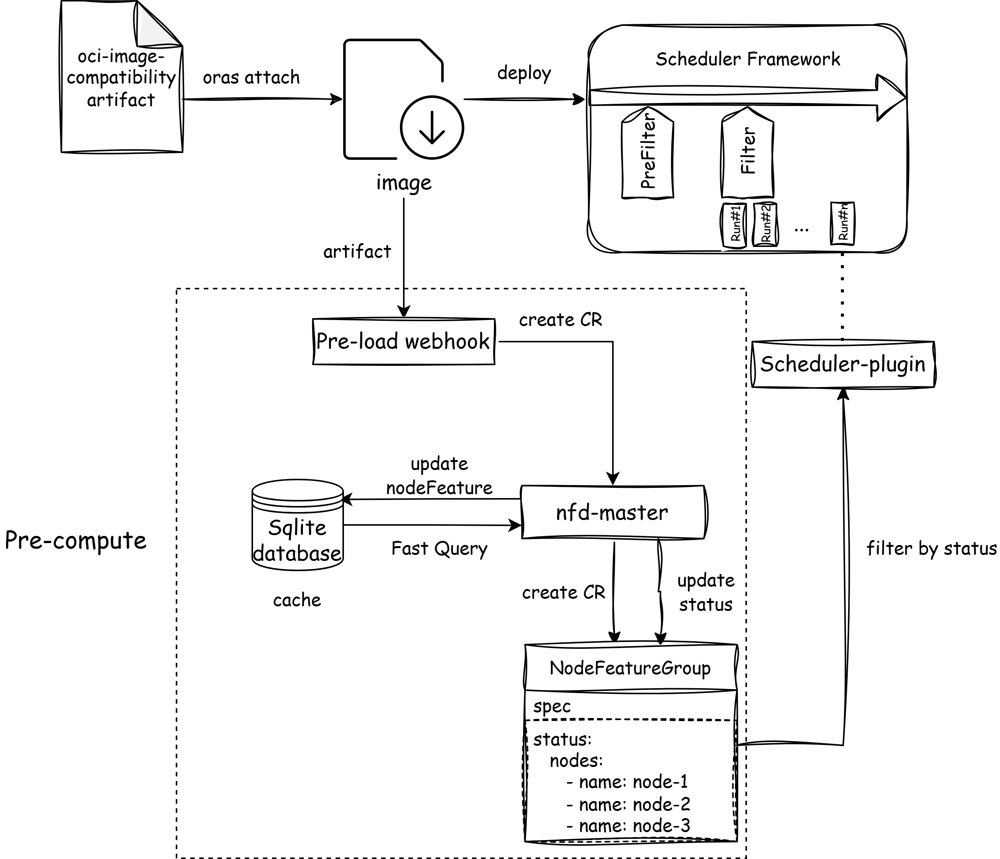

# KEP-2403: Image Compatibility Scheduler with NFD
<!-- toc -->
- [Summary](#summary)
- [Motivation](#motivation)
  - [Goals](#goals)
  - [Non-Goals](#non-goals)
- [Proposal](#proposal)
  - [User Stories](#user-stories)
  - [Risks and Mitigations](#risks-and-mitigations)
    - [Node Features Drift Handling](#node-features-drift-handling)
    - [NFG Status Update Latency](#nfg-status-update-latency)
- [Design Details](#design-details)
  - [Component Responsibilities](#component-responsibilities)
  - [Security](#security)
  - [Proposal C: Node Pre-grouping](#proposal-c-node-pre-grouping)
    - [Workflow](#workflow)
    - [Example Flow](#example-flow)
    - [Key Characteristics](#key-characteristics)
    - [Exception Handling](#exception-handling)
    - [Advantages](#advantages)
    - [Limitations](#limitations)
  - [Test Plan](#test-plan)
  - [Graduation Criteria](#graduation-criteria)
    - [Alpha](#alpha)
    - [Beta](#beta)
    - [GA](#ga)
- [Implementation History](#implementation-history)
- [Alternatives Considered](#alternatives-considered)
  - [Use Node Affinity/Node Selector Directly in Pod Spec](#use-node-affinitynode-selector-directly-in-pod-spec)
  - [Alternative design proposals](#alternative-design-proposals)
    - [Proposal A: NodeFeatureGroup Check](#proposal-a-nodefeaturegroup-check)
    - [Proposal B: SQLite Database Caching for Node Features in Large Scale Clusters(Discarded)](#proposal-b-sqlite-database-caching-for-node-features-in-large-scale-clustersdiscarded)
<!-- /toc -->

## Summary

Cloud-native technologies are being adopted by high-demand industries where container compatibility is critical for service performance and cluster preparation. The integration of workloads requiring specific resource adaptations (acceleration, specific networking behavior, ..) can quickly become complex and often involves multiple back-and-forths between the infrastructure teams and workload vendors. A convergence is usually necessary to align application needs with available resources. Experience shows that this is a significant cause of deployment delays.
Building upon the first phase of [KEP-1845 Proposal](https://github.com/kubernetes-sigs/node-feature-discovery/blob/master/enhancements/1845-nfd-image-compatibility/README.md), which completed node compatibility validation, this proposal introduces a compatibility scheduling plugin. This plugin introduces a new `ImageCompatibilityQuery` CRD to filter nodes that meet compatibility requirements, while leveraging existing `NodeFeatureGroup` for node pre-grouping optimization. It effectively schedules pods to compatible nodes, enabling automated and intelligent compatibility scheduling decisions to meet the application's need for a specific, compatible environment.

## Motivation

The first phase of [KEP-1845 Proposal](https://github.com/kubernetes-sigs/node-feature-discovery/blob/master/enhancements/1845-nfd-image-compatibility/README.md) introduced compatibility metadata to help container image authors describe compatibility requirements in a standardized way. This metadata is uploaded to the image registry alongside the image. Based on this container compatibility metadata, the compatibility scheduler plugin automatically analyzes the compatibility requirements of container images, filters suitable nodes for scheduling, and ensures that containers run on compatible nodes.

### Goals

- Implement an image compatibility scheduling plugin based on NFD to schedule Pods to compatible nodes, providing a production-ready scheduling extension for tracking image compatibility requirements.
- Introduce a new `ImageCompatibilityQuery` CRD to represent per-image compatibility queries.
- Implement a mutating webhook to parse OCI artifacts during Pod admission and create ICQ CRs with compatibility rules.
- Enhance nfd-master to compute `NodeFeatureGroup` pre-group homogeneity per ICQ and detect post-scheduling node feature drift.
- Leverage existing `NodeFeatureGroup` for node pre-grouping to optimize scheduling performance from O(N) to O(G) complexity.

### Non-Goals

- Making image compatibility scheduling plugin a hard requirement for the NFD usage.
- Cover applications ABI compatibility.

## Proposal

### User Stories

When deploying applications that require specific hardware or software features (e.g., AVX2 support, specific kernel versions, or GPU availability), users want to ensure that their pods are scheduled only on nodes that meet these compatibility requirements. This is particularly important for workloads in high-performance computing, machine learning, and other specialized domains where compatibility directly impacts performance and functionality.

### Risks and Mitigations

#### Node Features Drift Handling
When node features drift over time (e.g., due to software updates or hardware changes), it can lead to mismatches between the pre-group definitions and the actual node capabilities. This drift can compromise the effectiveness of the pre-grouping strategy.
It can be divided into two scenarios:
1. **Drift Before Scheduling:** nfd-master detects feature drift and uses the ICQ feature dimensions to recompute the homogeneity of pre-groups (`NodeFeatureGroup`). Additionally, the **PreBind phase** performs real-time validation using the latest node features, catching any race conditions where ICQ status might be stale.
2. **Drift After Scheduling:** When drift happens after a pod has been scheduled, nfd-master detects the drifted node features, evaluates which ICQs are affected by comparing the drifted features against `spec.compatibilities[*].rules`, finds pods bound to the drifted nodes via ICQ references, and alerts administrators through:
   - **Pod labels**: `feature.node.kubernetes.io/compatibility-drift: "true"`
   - **Pod annotations**: `nfd.node.kubernetes.io/drift-node: "<node-name>"`, `nfd.node.kubernetes.io/drift-time: "<RFC3339-timestamp>"`
   - **Structured logs**: JSON format with pod/node/image/drifted_features details
   - **K8s Events**: Warning events with `reason: NodeCompatibilityDrift`
   
   Administrators can query affected pods via label selector and decide whether to migrate. No automatic migration is performed to avoid intrusive operations.

#### NFG Status Update Latency
If `NodeFeatureGroup` status updates are delayed, it can lead to stale information being used during the scheduling process. This latency can impact the accuracy of compatibility checks and potentially result in suboptimal scheduling decisions. However, since the pre-grouping can reduce the latency of NFG updates, the impact of this latency is limited. The **PreBind phase** provides a final validation step before binding, ensuring that any update latency is accounted for and stale status is caught before pod placement.

## Design Details
The core of this proposal is to implement an `ImageCompatibilityPlugin` within the Kubernetes scheduler framework, working with a new `ImageCompatibilityQuery` (ICQ) CRD and existing `NodeFeatureGroup` (NFG) CRD.

### Component Responsibilities
- **Mutating Webhook**: Parses OCI artifacts during Pod admission. Checks if an ICQ already exists (by the digest-pair name); if not, fetches the OCI artifact and creates an ICQ CR with `spec.compatibilities` only (no status computation). The ICQ CR itself serves as the persistent cache. Enforces a 5-second timeout on OCI artifact fetches. On registry failure or timeout, applies the compatibility failure policy (see Key Characteristic 3): the default `Fail` blocks pod creation, while `Ignore` admits the pod without the `icq-refs` annotation. If the fetch succeeds and the image has no compatibility metadata, the pod is admitted without creating an ICQ or adding the `icq-refs` annotation (no-op). Increments the ICQ refcount (annotation `nfd.node.kubernetes.io/refcount`) when it adds the `icq-refs` annotation to a Pod.
- **Scheduler Plugin**: Computes and updates `status.compatibleNodesByRule` for ICQs (setting `conditions[Ready]=True` once computed), performs filtering of compatible nodes from ICQs (union within an ICQ, intersection across ICQs), scoring by weight, and PreBind validation.
- **nfd-master**: Updates `NodeFeatureGroup` status for admin-defined pre-groups only, computes pre-group homogeneity for each ICQ and records it in the ICQ `status.groupHomogeneity`, clears the ICQ `conditions[Ready]` when a pre-group membership changes or homogeneity is recomputed (feature drift), and detects post-scheduling drift by comparing drifted node features against ICQ compatibility rules.
- **GC Controller**: Watches pod termination events, decrements the ICQ refcount via optimistic concurrency patch (retry on resourceVersion conflict), and deletes the ICQ when refcount reaches 0 and the TTL expires.

### Security

- **Registry Credentials:** The webhook reads registry credentials from secrets synced by the administrator into the webhook's own namespace. RBAC is scoped to `get secrets` in the webhook namespace only.
- **SSRF Prevention:** The webhook enforces a configurable registry allowlist (`--allowed-registries` flag). Image references pointing to registries outside the allowlist will not be fetched.
- **Webhook Availability:** The `MutatingWebhookConfiguration` uses `failurePolicy: Fail` with `timeoutSeconds: 10`, leaving the webhook's own 5-second OCI fetch budget room to expire and apply the compatibility failure policy before the API server abandons the call. It sets `sideEffects: NoneOnDryRun` and `admissionReviewVersions: ["v1"]`, and the handler skips ICQ creation when the request carries `dryRun`. A `namespaceSelector` exempts `kube-system` and the NFD deployment namespace, so a webhook outage blocks pod creation only in non-exempt namespaces and cannot prevent the webhook itself (or the control plane) from being restored.
- **RBAC Surface:**

| Component | RBAC Permissions |
|-----------|-----------------|
| Mutating Webhook | `create`, `get`, `patch` on `ImageCompatibilityQuery` (refcount increment); `get` on `Secrets` in the webhook namespace |
| Scheduler Plugin | `get`, `list`, `watch` on `ImageCompatibilityQuery`; `update` on `imagecompatibilityqueries/status`; `get`, `list`, `watch` on `NodeFeatureGroup` and `NodeFeature` |
| nfd-master | `get`, `list`, `watch` on `NodeFeatureGroup`; `patch`, `update` on `nodefeaturegroups/status`; `get`, `list`, `watch` on `ImageCompatibilityQuery`; `update` on `imagecompatibilityqueries/status` (homogeneity); `patch` on `Pods` (drift labels); `create` on `Events` |
| GC Controller | `get`, `list`, `watch`, `patch`, `delete` on `ImageCompatibilityQuery`; `get`, `list`, `watch` on `Pods` |

### Proposal C: Node Pre-grouping



For large scale clusters, node pre-grouping is a method to significantly reduce computational overhead. The core idea is to pre-organize all nodes into several groups based on specific, static rules (e.g., `cpu.model`, `kernel.version`) using `NodeFeatureGroup`. This optimization changes the scheduling complexity from checking **N (number of nodes)** down to just **G** groups (**G<<N**) in the critical path.

**New CRD: ImageCompatibilityQuery (ICQ)**

A new CRD `ImageCompatibilityQuery` is introduced to represent per-image compatibility queries. Unlike `NodeFeatureGroup` which groups nodes, ICQ represents the compatibility requirements of a specific image.

```yaml
apiVersion: nfd.k8s-sigs.io/v1alpha1
kind: ImageCompatibilityQuery
metadata:
  name: icq-aaa123-xyz789      # name = "icq-" + image digest (12 chars) + "-" + artifact digest (12 chars)
  annotations:
    nfd.node.kubernetes.io/image-digest: "sha256:aaa123..."      # full image digest
    nfd.node.kubernetes.io/artifact-digest: "sha256:xyz789..."   # latest NFD compatibility artifact digest
    nfd.node.kubernetes.io/image-ref: "registry.example.com/app@sha256:aaa..."
    nfd.node.kubernetes.io/refcount: "3"
    nfd.node.kubernetes.io/last-used: "2026-06-15T10:05:00Z"
spec:
  version: "v1"
  compatibilities:
    - rules:
        - name: "optimal"
          matchFeatures:
            - feature: kernel.version
              matchExpressions:
                major: {op: In, value: ["6"]}
            - feature: cpu.cpuid
              matchExpressions:
                AVX2: {op: Exists}
      weight: 100
      tag: "preferred"
      description: "Optimal: kernel 6.x + AVX2"
    - rules:
        - name: "minimum"
          matchFeatures:
            - feature: kernel.version
              matchExpressions:
                major: {op: In, value: ["5", "6"]}
      weight: 50
      tag: "minimum"
      description: "Minimum: kernel 5.x+"
status:
  groupHomogeneity:
    - groupName: group-1        # computed asynchronously by nfd-master
      homogeneous: true
    - groupName: group-3
      homogeneous: false
  compatibleNodesByRule:
    - tag: "preferred"
      weight: 100
      groupRefs:                # homogeneous groups matched via a single representative node
        - groupName: group-1
      nodes:                    # individually matched nodes (heterogeneous or ungrouped)
        - name: node-8001
    - tag: "minimum"
      weight: 50
      groupRefs:
        - groupName: group-1
        - groupName: group-2
      nodes:
        - name: node-8005
        - name: node-8008
  conditions:
    - type: Ready
      status: "True"
      lastTransitionTime: "2026-06-15T10:00:00Z"
```

**ICQ Spec Structure:**
- `spec.version`: Version of the compatibility spec (matches OCI artifact version)
- `spec.compatibilities`: List of compatibility sets, each containing:
  - `rules`: List of Node Feature Rules (same structure as `NodeFeatureGroup`)
  - `weight`: Priority of the compatibility set (higher = more preferred)
  - `tag`: Label for grouping/distinguishing compatibility sets
  - `description`: Human-readable description

**ICQ Status Structure:**
- `status.groupHomogeneity`: Pre-group homogeneity computed by nfd-master, one entry per pre-group `NodeFeatureGroup`, containing:
  - `groupName`: References the pre-group `NodeFeatureGroup`
  - `homogeneous`: Whether all nodes in the group share identical values for the ICQ's compatibility dimensions
- `status.compatibleNodesByRule`: Nodes grouped by compatibility rule, each containing:
  - `tag`: Matches the tag from spec
  - `weight`: Matches the weight from spec
  - `groupRefs`: Homogeneous pre-groups matched via a single representative node
  - `nodes`: Individually matched compatible nodes (from heterogeneous or ungrouped sets, each with a `name` field)
- `status.conditions[Ready]`: The invalidation latch. nfd-master sets it to `False` when a pre-group membership changes or homogeneity is recomputed (feature drift); the scheduler sets it to `True` after (re)computing `compatibleNodesByRule`. When `Ready` is not `True`, the next Prefilter recomputes the status.

#### Workflow

The process involves these main phases:

1. **Initial Cluster Grouping (Optional):** In the cluster preparation stage, administrator should divide the cluster nodes into several groups by `NodeFeatureGroup`. Multiple `NodeFeatureGroup` CRs are created declaratively, each defining a grouping rule. Their status is populated with all matching nodes by nfd-master, completing the pre-grouping setup. The pre-grouping can effectively reduce the latency of scheduling, while it's not mandatory especially for small clusters.
2. **Pod Admission (Webhook):** During Pod creation, the mutating webhook:
   - Extracts image references from all containers.
   - For each image:
     - Fetches image manifest from registry to get image digest.
     - Fetches the latest NFD compatibility artifact to get artifact digest.
     - Constructs ICQ name: `icq-{image-digest-12chars}-{artifact-digest-12chars}`.
     - Checks if ICQ already exists：If ICQ exists → reuses it. If ICQ does not exist → parses compatibility rules and creates the ICQ CR.
   - Annotates the Pod with ICQ references: `nfd.node.kubernetes.io/icq-refs: "icq-xxx,icq-yyy"`.
3. **Scheduling Prefilter Phase:** The scheduler plugin:
     - Reads Pod annotations to get the ICQ references (`nfd.node.kubernetes.io/icq-refs`).
     - For each ICQ, checks whether `status.compatibleNodesByRule` is ready: it verifies that `conditions[Ready]` is `True` (a `False`/absent value means nfd-master invalidated the result because a pre-group membership changed or feature drift was detected).
     - If the status is missing or stale, computes it **synchronously** by evaluating each compatibility rule against admin pre-groups (node features are read from `NodeFeature` CRs):
        - For each pre-group `NodeFeatureGroup`, consults `status.groupHomogeneity` (written by nfd-master).
        - If `homogeneous: true`, uses representative node matching: selects one representative node and checks if it satisfies the rules. If it matches, the group is recorded as a `groupRef` in the corresponding `status.compatibleNodesByRule` entry (its nodes are not expanded). If it does not match, the group is skipped.
        - If `homogeneous: false` or missing, uses node-by-node matching: each node in the group is checked against the rule individually, and matches are added to the `nodes` list.
        - Ungrouped nodes are evaluated node-by-node and matches are added to `nodes`.
     - Updates `status.compatibleNodesByRule` and sets `conditions[Ready]=True`.
4. **Scheduling Filter Phase:** For each relevant ICQ, the scheduler expands `groupRefs` (via the referenced pre-group's `status.nodes`) and computes the **union** with `status.compatibleNodesByRule[*].nodes`, then takes the **intersection** across multiple ICQs (for multi-image Pods) to determine candidate nodes.
5. **Scheduling Score Phase:** For each candidate node, the scheduler assigns a score based on the `weight` of the compatibility rule it belongs to (if a node belongs to multiple rules, use the highest weight).
6. **Scheduling PreBind Phase:** A final validation step that re-verifies node compatibility using the latest node features from `NodeFeature` CRs. This catches any race conditions where ICQ status might be stale due to delayed informer updates. If validation fails, the binding is rejected and the pod is rescheduled.

#### Example Flow

Assume a cluster with 10,000 nodes pre-grouped into 10 groups (`Group-1` to `Group-10`) via `NodeFeatureGroup`. A Deployment with 3 replicas is created, where each Pod has 2 containers: `app@sha256:aaa` and `sidecar@sha256:bbb`.

**Phase 1: NFD Feature Collection (nfd-master)**
- NFD workers on all nodes report hardware/software features to nfd-master.
- nfd-master updates `NodeFeatureGroup` status: for each pre-group, computes `status.nodes` containing all nodes matching the group's criteria.

**Phase 2: Pod Creation (Webhook)**
- The mutating webhook intercepts the first Pod creation.
- For `app@sha256:aaa`: webhook fetches image manifest (image-digest=sha256:aaa) and latest NFD compatibility artifact (artifact-digest=sha256:xxx), checks if ICQ `icq-aaa-xxx` exists → No → extracts compatibilities (e.g., preferred: kernel 6.x + AVX2 weight=100; minimum: kernel 5.x+ weight=50), creates ICQ CR with `spec.compatibilities`.
- For `sidecar@sha256:bbb`: webhook fetches image manifest (image-digest=sha256:bbb) and latest NFD compatibility artifact (artifact-digest=sha256:yyy), checks if ICQ `icq-bbb-yyy` exists → No → extracts compatibilities (e.g., kernel 5.x+ weight=100), creates ICQ CR.
- Pod is annotated with `nfd.node.kubernetes.io/icq-refs: "icq-aaa-xxx,icq-bbb-yyy"` and admitted.
- For the 2nd and 3rd replicas: webhook finds ICQs already exist → reuses them (no registry fetch). Only 2 registry fetches total for all 3 Pods.

**Phase 3: Homogeneity Check (nfd-master, triggered by ICQ creation)**
- nfd-master watches node feature drift events and ICQ creation events via informer.
- When a new ICQ is created (e.g., `icq-aaa-xxx`) or node feature drift is detected, nfd-master extracts the compatibility dimensions from all rules in the ICQ `spec.compatibilities` (e.g., kernel.version, cpu.cpuid.AVX2).
- For each pre-group, checks whether all nodes have the same values for these dimensions and records the result in the ICQ `status.groupHomogeneity`:
  - `Group-1` is homogeneous → `{groupName: group-1, homogeneous: true}`.
  - `Group-3` is heterogeneous (mixed AVX2 support) → `{groupName: group-3, homogeneous: false}`.

**Phase 4: Scheduler Computes ICQ Status (Scheduler Plugin, during Prefilter)**
- Scheduler plugin computes ICQ status synchronously during the Prefilter phase when `status.compatibleNodesByRule` is missing or stale.
- For `icq-aaa-xxx` (preferred: kernel 6.x + AVX2 weight=100; minimum: kernel 5.x+ weight=50):
  - Evaluates each pre-group based on its homogeneity result, for each compatibility rule:
  - `Group-1` (homogeneous=true): representative node matches preferred rule → records `Group-1` as a `groupRef` in `compatibleNodesByRule[preferred]` (1,200 nodes); also matches minimum rule → records it in `compatibleNodesByRule[minimum]`.
  - `Group-2` (homogeneous=true): representative node does not match preferred (no AVX2) → skips preferred; matches minimum (kernel 6.x) → records `Group-2` as a `groupRef` in `compatibleNodesByRule[minimum]`.
  - `Group-3` (homogeneous=false): node-by-node matching → adds 800 node names to preferred, 1,500 node names to minimum.
  - Final `compatibleNodesByRule`: preferred = 2,000 nodes (Group-1 via `groupRef` + 800 individual nodes from Group-3); minimum = 8,200 nodes (Group-1 and Group-2 via `groupRef`, plus 1,500 individual nodes from Group-3).
- For `icq-bbb-yyy` (kernel 5.x+ weight=100):
  - Similar evaluation → `compatibleNodesByRule[default]` = 8,200 nodes.

**Phase 5: Scheduling**
- **Prefilter**: Scheduler reads Pod annotations, queries and updates the ICQ status.
- **Filter**: For each ICQ, expands `groupRefs` (via pre-group `status.nodes`) and computes the union with `compatibleNodesByRule[*].nodes`. Then computes intersection across ICQs: (2,000 ∪ 8,200) ∩ 8,200 = 8,200. Applies affinity/nodeSelector if present.
- **Score**: For each candidate node, assigns score based on highest weight from matching rules. Nodes in preferred (weight=100) get higher scores than nodes only in minimum (weight=50).
- **PreBind**: Re-validates node compatibility using latest features from `NodeFeature` CRs. If node is incompatible, rejects binding and reschedules.
- **Bind**: Pod bound to selected node.

**Performance Impact:** Without pre-grouping, evaluating 10,000 nodes per ICQ would require 20,000 checks. With pre-grouping and homogeneity check, homogeneous groups use representative node matching (O(G)), while heterogeneous groups use node-by-node matching. In this example, 9 homogeneous groups need only 18 checks, 1 heterogeneous group (1,500 nodes × 2 checks) needs 3,000 checks, totaling ~3,018 checks — still a significant reduction.

#### Key Characteristics

1. **Administrator-Driven Grouping (Preparation Phase):**
   - Node groups are statically predefined by the cluster administrator using `NodeFeatureGroup` in cluster preparation phase.
   - Aligns with common large-scale cluster management practices where operators organize nodes into pools based on node features.
   - Each `NodeFeatureGroup` defines grouping rules (e.g., kernel version, CPU features) and nfd-master populates `status.nodes` with matching nodes.

2. **Mutating Webhook Design (Pod Creation Phase):**
   - The webhook deduplicates against the ICQ digest-pair name, so a Deployment with 1000 replicas of the same image triggers only one registry fetch; the other 999 Pods reuse the existing ICQ CR (see Workflow Phase 2).
   - **Local LRU Cache (TTL 60s):** Webhook maintains an in-memory LRU cache to avoid repeated registry access within short time windows. Combined with the ICQ CR as persistent cache, this two-layer caching prevents registry rate limiting while naturally handling artifact updates (TTL expiry triggers re-fetch, detects artifact-digest changes, creates a new ICQ if needed).

3. **Failure Policy for Compatibility Resolution:**
   - A failure to resolve compatibility metadata (e.g., the registry is unreachable or the OCI artifact fetch times out) is treated as a policy decision:
      - **Fail (Fail-closed, default):** Block pod creation at admission or mark the Pod Unschedulable at scheduling, depending on where the failure is detected. Suitable for production clusters where compatibility is critical.
      - **Ignore (Fail-open):** Skip the compatibility check and allow scheduling on any node. Suitable for development clusters.
   - Images that simply carry no compatibility metadata impose no constraints (see Key Characteristic 9) and are never subject to this policy.
   - The policy is applied cluster-wide via scheduler/plugin configuration.

4. **ICQ Lifecycle Management (Persistent Cache):**
   - ICQs are named by combination key (`icq-{image-digest-12chars}-{artifact-digest-12chars}`), enabling automatic deduplication and artifact change detection. Name length is 29 characters, well within Kubernetes limits.
   - 1000 replicas of the same image result in only 1 ICQ CR.
   - Reference counting (via annotation `nfd.node.kubernetes.io/refcount`) and TTL-based GC manage the lifecycle.
   - The mutating webhook increments the refcount when it adds `icq-refs` to a Pod; the GC controller decrements it when that same Pod terminates. Both use an optimistic concurrency patch with retry on `resourceVersion` conflict, so concurrent admissions of one image do not lose increments.
   - The GC controller deletes the ICQ when the refcount reaches 0 and the TTL expires.

5. **Scheduler Plugin Manages ICQ Status (Status Computation):**
   - The scheduler plugin computes and updates `status.compatibleNodesByRule` for ICQs, ensuring tight integration with the scheduling lifecycle.
   - Status computation uses pre-group acceleration (see next point).
   - Staleness is handled through `conditions[Ready]`: nfd-master lowers it on pre-group membership change or feature drift, and the scheduler raises it after (re)computing `compatibleNodesByRule`.

6. **Homogeneity Check Implementation (nfd-master):**
   - **ImageCompatibility Controller:** An asynchronous controller within nfd-master that checks homogeneity for each pre-group NFG against each ICQ and records the result in the ICQ `status.groupHomogeneity`.
   - **Check Algorithm:**
     1. Extract ICQ dimensions from all rules in `spec.compatibilities[*].rules` (e.g., `[kernel.version, cpu.cpuid.AVX2]`).
     2. For each node in the pre-group, compute a hash of its feature values for the ICQ dimensions using a length-prefixed encoding of each `<name, value>` pair (e.g., `SHA256(name + ":" + len(value) + ":" + value)`), so distinct tuples cannot collide.
     3. For each pre-group NFG, check whether all nodes in the group share the same hash value.
   - **Trigger Events:** ICQ creation/update, NodeFeature changes.
   - The result is written to `status.groupHomogeneity` and lives with the ICQ, keeping the per-image homogeneity data scoped to the ICQ and garbage-collected together with it.

7. **Representative Node Matching (Performance Optimization):**
   - The core performance optimization evaluates only a **single representative node** from each pre-existing group against each compatibility rule in the ICQ, rather than scanning all nodes.
   - Reduces complexity from O(N) to O(G) where G is the number of groups (typically 10-50) and N is the total number of nodes.
   - For each pre-group (processed asynchronously via nfd-master), the matching strategy is determined by the `status.groupHomogeneity` entry:
      - **`homogeneous: true`** → representative node matching: if the representative node matches a rule, the group is recorded as a `groupRef` in the corresponding `status.compatibleNodesByRule` entry. If it does not match, the entire group is skipped for that rule.
      - **`homogeneous: false`/missing** → node-by-node matching: each node in the group is checked against the ICQ rules individually, and matches are added to the `nodes` list.

8. **Ungrouped Node Handling (Status Computation):**
   - Nodes that do not belong to any `NodeFeatureGroup` are automatically handled through an implicit residual set mechanism.
   - During ICQ status computation, the scheduler plugin identifies ungrouped nodes: `ungroupedNodes = allNodes - ∪(all pre-group status.nodes)`.
   - Ungrouped nodes are evaluated individually using per-node matching.
   - Matching ungrouped nodes are added to the corresponding entries in `status.compatibleNodesByRule` alongside matched pre-group nodes.
   - If all nodes are ungrouped, the system degrades gracefully to full per-node scanning (O(N) complexity).

9. **Multi-Image Pod Handling (Filter Phase):**
   - For Pods with multiple containers (app + init + sidecars), each image gets its own ICQ.
   - For each ICQ, the scheduler expands `groupRefs` (via the referenced pre-group's `status.nodes`) and computes the **union** with `status.compatibleNodesByRule[*].nodes`.
   - Then the scheduler computes the **intersection** across all ICQs to determine candidate nodes.
   - Example: Pod has image-A (union=nodes 1-500) and image-B (union=nodes 1-800) → final compatible nodes are 1-500 (intersection).
   - Only images carrying compatibility metadata constrain scheduling; images without metadata are skipped (no ICQ is created).

10. **Affinity/NodeSelector Compatibility (Filter Phase):**
    - The compatibility scheduling plugin works alongside existing node affinity and node selector mechanisms.
    - Compatibility filtering happens in the Filter phase, producing a set of compatible nodes.
    - This set is then intersected with nodes selected by affinity/nodeSelector rules (handled by native Kubernetes scheduler plugins).
    - A node must satisfy both compatibility requirements AND affinity/nodeSelector constraints.
    - Example: compatibility filtering selects nodes 1-500, node affinity selects nodes 300-800 → final candidate nodes are 300-500 (intersection).

11. **PreBind Validation (Final Validation):**
    - Before binding, the plugin re-checks the selected node against the latest `NodeFeature` data, rejecting the binding (and rescheduling) if the node drifted between Prefilter and PreBind — closing the race left by cached status (see Workflow Phase 6).

#### Exception Handling

- If the OCI Artifact is unreachable (fetch timeout or network error), no ICQ is created: under the default `Fail` compatibility failure policy the webhook blocks pod creation, while under `Ignore` it admits the pod without the `icq-refs` annotation. If the webhook pod itself is unreachable, the `MutatingWebhookConfiguration.failurePolicy` applies: with `Fail`, pod creation is blocked in non-exempt namespaces until the webhook recovers, while pods in the exempt `kube-system`/NFD namespaces are admitted (without `icq-refs`) so the webhook can be restored. A warning event is generated for visibility.
- If the image has no compatibility metadata, the webhook admits the pod without creating an ICQ or adding the `icq-refs` annotation. Such pods are exempt from compatibility filtering and are not subject to the failure policy (see Key Characteristic 9).
- If no compatible nodes are found after evaluating **all paths** — homogeneous groups (representative node matching), heterogeneous groups (node-by-node matching), and ungrouped nodes (node-by-node matching) — the plugin concludes that no compatible nodes exist in the cluster, resulting in a scheduling failure for the pod with logging an error.
- If a pre-group is found to be empty (i.e., its `status.nodes` list is empty), the plugin skips that group during evaluation, ensuring that only valid groups are considered.
- If PreBind validation fails (node drifted during scheduling), the binding is rejected and the pod is rescheduled to a compatible node.

#### Advantages

- **Significant Reduction in Computational Cost:** Shifts the complexity in the scheduling critical path from `O(N)` to `O(G)` (G is the group number, G<<N), delivering orders-of-magnitude performance improvement.
- **Aligns with Common Large Scale Cluster Practice:** Node grouping is common in large scale cluster, where administrators define multiple `NodeFeatureGroup` resources and assign nodes to these groups in advance.
- **Backward Compatible:** Works seamlessly with existing node affinity and node selector mechanisms, allowing users to combine compatibility requirements with other scheduling constraints.

#### Limitations

- **Homogeneity Detection Overhead:** nfd-master must compute homogeneity for each ICQ-pre-group pair, which adds computational overhead proportional to the number of ICQs and pre-groups.

### Test Plan

To ensure the proper functioning of the compatibility scheduler plugin, the following test plan should be executed:

- **Unit Tests:** Write unit tests covering core logic for the plugin.
- **Manual e2e Tests:** Validate core end-to-end functionality by deploying a sample pod with compatibility artifacts. Including:
    - The ImageCompatibilityQuery is created correctly and the pod is successfully routed to a compatible node.
    - Digest-pair deduplication, reference counting and TTL lazy deletion apply correctly.
    - PreBind validation catches stale ICQ status and rejects binding to drifted nodes.
    - Post-scheduling drift detection labels affected pods and generates events.
    - Webhook fetch timeout correctly rejects pod admission.
- **Fault-Injection Tests:** Explicitly validate system resilience and fallback safety under the following failure modes:
    - **Registry Service Outage / Downtime:** Verify that when metadata becomes unreachable, the webhook blocks pod creation.
    - **NFD-Master Restart / Crash:** Verify that while the Master is offline, the scheduler can continuously make safe decisions using cached NodeFeatureGroup states, and validate that state synchronization latency remains minimal once the Master recovers.
    - **Stale ICQ Status:** Artificially inject a delay in ICQ status computation to verify that PreBind validation catches the staleness and rejects binding.
    - **Node Feature Drift During Scheduling:** Simulate a node feature change between Prefilter and PreBind to verify that PreBind validation rejects the drifted node.
- **Performance Tests:** Measure scheduling latency and ICQ update overhead under simulated heavy loads using Kwok (at 1k, 5k, and 10k nodes).
    - **Performance Test Baseline (Warm Cache — ICQ exists, informer warmed):**

| Cluster Size (Nodes) | P99 Prefilter | P99 Filter | P99 Pod-Arrival-to-Bind | 1000 Pods Scheduling Duration |
| :--- | :--- | :--- | :--- | :--- |
| **1k** | < 50ms | < 20ms | < 100ms | < 10s |
| **5k** | < 100ms | < 50ms | < 200ms | < 20s |
| **10k** | < 200ms | < 100ms | < 500ms | < 50s |

    - **Performance Test Baseline (Cold Cache — first scheduling of new image):**

| Cluster Size (Nodes) | P99 Prefilter | P99 Filter | P99 Pod-Arrival-to-Bind | 
| :--- | :--- | :--- | :--- |
| **1k** | < 500ms | < 20ms | < 1s |
| **5k** | < 1s | < 50ms | < 2s |
| **10k** | < 2s | < 100ms | < 4s |

### Graduation Criteria

#### Alpha
- Core Functionality Implementation: Complete the core development of the image compatibility scheduling plugin and NFG features.
- Basic Verification: Complete full E2E testing in a 100-node cluster to ensure all features are fully operational.
#### Beta
- Scalability Simulation: Complete simulation verification on a 5,000-node cluster, meeting test baseline (P99 Pod-Arrival-to-Bind < 2s).
- Fault Tolerance: Validate graceful degradation under abnormal scenarios (e.g., Registry latency/downtime, NFD-Master restarts).
#### GA
- Extreme Performance & Production Verification: Complete long-term stability testing at a scale of 10,000 nodes, meeting test baseline (P99 Pod-Arrival-to-Bind < 4s).
- Production Adoption: Gather deployment cases and performance feedback reports under real-world workloads from at least 2 independent production environments.

## Implementation History
- 2025-12-27: KEP proposal submission
- 2026-01-20: Update KEP with proposal C (Node pre-grouping) chosen as preferred solution.
- 2026-06-30: Update KEP with refined architecture.

## Alternatives Considered

### Use Node Affinity/Node Selector Directly in Pod Spec
Using standard Kubernetes features like Node Affinity or Node Selector directly in the Pod specification to specify compatibility requirements was considered. However, this approach has several limitations:
- Not all node features are reflected in labels.
- Compatibility rules are typically structured, multi-dimensional, and frequently updated. Node affinity/Node selector, in essence, is a static label-matching system and is unsuitable to handle such dynamic and complex requirements.
- In large scale clusters, node affinity/node selector does not perform well in terms of time consumption.

### Alternative design proposals
#### Proposal A: NodeFeatureGroup Check



The basic solution is a direct, on-demand approach by utilizing the `NodeFeatureGroup` Custom Resource (CR) to dynamically define and manage node compatibility groups at scheduling time.

**Workflow:**

1. **CR Creation and Update (Prefilter Phase):** When a pod with specific image requirements enters the scheduling queue, the scheduler plugin fetches the attached OCI Artifact. It extracts the compatibility metadata (e.g., required kernel features) and **instantly creates a new `NodeFeatureGroup` CR**. This CR's specification defines the dynamic compatibility rules.

   The `update NodeFeatureGroup` operation evaluates **all nodes in the cluster** against the CR's specification rules and updates the CR's `status` field with the list of nodes that satisfy the compatibility demands.

   ```yaml
   apiVersion: nfd.k8s-sigs.io/v1alpha1
   kind: NodeFeatureGroup
   metadata:
     name: node-feature-group-example
   spec:
     featureGroupRules:
       - name: "kernel version"
         matchFeatures:
           - feature: kernel.version
             matchExpressions:
               major: {op: In, value: ["6"]}
   status:
     nodes:
       - name: node-1
       - name: node-2
       - name: node-3
   ```

2. **Node Filtering (Filter Phase):** In the scheduler's final filter phase, retrieve the dynamically created `NodeFeatureGroup` CR and filters the candidate nodes, ensuring that only nodes listed in the CR's `status` are considered compatible.

**Advantages**

- **Simplicity:** Filter candidate nodes by compatible nodes set from `NodeFeatureGroup`.
- **Non-Invasive:** Without modifications to existing `NodeFeatureGroup` operation.

**Limitations**

- **Performance Limitation:** The requirement to evaluate **all cluster nodes** for each scheduling request creates a linear scalability bottleneck (`O(N)` complexity). In a large scale cluster (e.g., 65,000 nodes), this introduces significant latency in the scheduling critical path.
- **No Caching:** Repeated scheduling for similar image requirements results in redundant node evaluation work, as no intermediate results are cached or reused.

#### Proposal B: SQLite Database Caching for Node Features in Large Scale Clusters(Discarded)



NodeFeatureGroup(NFG) updates status by computing all nodes' features. It can become performance bottleneck in a large scale cluster. The problem is conceptually similar to **map-reduce**, where data must be aggregated before processing.

To achieve this, we'll need an additional controller that watches nodes, collects reports from workers, and maintains a cache database with grouped nodes. NFG would then act on this cached, grouped data instead of raw per node inputs. Fast lookups will depend on an efficient cache data structure.

**Cache Implement** 

- **Implementation**: The NFD master is extended to include an **embedded SQLite database**, which functions as a high-performance local sink. It continuously aggregates and stores feature reports (e.g., CPU flags, kernel versions, PCI devices) collected from NFD worker daemons across all nodes in the cluster.
- **Data Model:** The database adopts an indexed **Entity-Attribute-Value (EAV) schema**. Each record explicitly links a node (the Entity) with a specific feature name (the Attribute) and its current state (the Value), enabling complex, multi-dimensional queries for node grouping.
- **Persistence:** To ensure data durability, the enhanced NFD master pod is configured with a **PVC (~100 GB)**. For optimal I/O performance critical to low-latency queries, the use of high-performance storage solutions (**Longhorn** or **local storage**) is recommended.

**NFG Update**

- **Fast Query**: When a NFG is deployed, the master can run a fast local sql query to determine which nodes match the group's conditions (e.g. `cpu.avx2=true`, `kernel.version>=6.6`, `pci.vendor=10de`). 
- **Pre Load**: Any image artifacts related NFG could be fetched asynchronously before scheduling (e.g., by an admission webhook or a small controller). The sqlite database is used only as a **precomputation engine** and not contained within the scheduling process. The NFG update process can be completed before scheduler process. The scheduler plugin would then watch those results in memory and perform constant time membership checks during scheduling. This approach keeps the scheduler's filter phase pure and nonblocking, avoiding disk or network I/O inside the hot path. 

**Scheduler Process**

- **Fetch results from NFG**: The scheduling workflow remains conceptually consistent with the basic solution (Solution 1). The critical difference is that all computationally expensive operations have been shifted to the asynchronous precomputation stage. The scheduler plugin just retrieves the precomputed results from the NFG status to identify the compatible nodes group.

**Advantages**

- **High Performance with Fast Queries:** By leveraging an indexed SQLite database with an EAV schema, node feature queries are executed with high efficiency. 
- **Non-blocking Scheduler Filter Phase:** All node evaluation and `NodeFeatureGroup` status calculations are completed asynchronously.

**Limitations**

- **Modification to NodeFeatureGroup Operations**
- **More work with NFG fetch webhook/controller:** This might become a new feature or a standalone solution.
